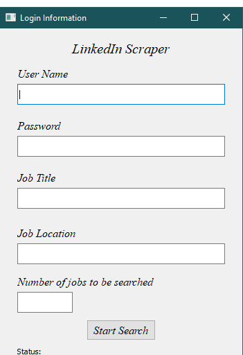

# LinkedIn Scraper
 
## Overview

This project is a LinkedIn job web scraper using Selenium Module in Python.

For the time being, this scraper will work in Brazilian-Portuguese language **only**.     

## How to Use

The usage is very simple. Firstly you need to install the required modules available at the _*requirements.txt*_ file. Then, run _*GUI_Interface.py*_.

You should see a dialog window opening up, with various input fields. Insert the LinkedIn login information, the job title, location and the amount of jobs to search for.

Once the procedure is finished, an Excel file is created on the project's working directory.

## Future Work

The following improvements are in mind:

- Add support for English-US LinkedIn information.
- Run the Scraper for at least 500 job postings. 
- Initiate a Data Analysis experiment with the collected data.
